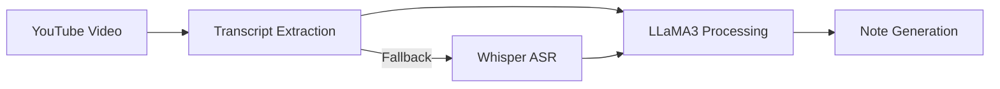

# 🎥 NoteGen: Transform YouTube Videos into Intelligent Notes

[](https://www.python.org/)
[](https://ai.meta.com/llama/)
[](https://github.com/openai/whisper)

**NoteGen** harnesses the power of cutting-edge AI to revolutionize how we learn from video content. By combining Meta's LLaMA3-70B (via Groq's lightning-fast inference engine) with OpenAI's Whisper, NoteGen transforms YouTube videos into comprehensive, structured notes that capture the essence of any content.

## 🚀 Key Features

### Advanced AI Integration
- **Dual-Engine Transcription**: Seamlessly switches between native YouTube transcripts and Whisper ASR for maximum accuracy
- **State-of-the-Art Summarization**: Leverages LLaMA3-70B through Groq's ultra-efficient API for nuanced content understanding
- **Multi-Language Support**: Process content in 5 different languages with native-quality results

### User Experience
- **Interactive Video Preview**: Rich thumbnail integration for content verification
- **Conversation History**: Track and review your note-generation history
- **Streamlined Interface**: Built with Streamlit for a smooth, intuitive user experience

## 🛠️ Technical Architecture



## 🔧 Installation

1. **Clone & Navigate**:
    ```bash
    git clone https://github.com/oussemabenhassena5/NoteGen-with-Llama-and-whisper.git
    cd NoteGen
    ```

2. **Set Up Environment**:
    ```bash
    python -m venv venv
    source venv/bin/activate  # Windows: `venv\Scripts\activate`
    pip install -r requirements.txt
    ```

3. **Configure API Keys**:
    ```bash
    # .env file
    GROQ_API_KEY=your_groq_api_key_here
    ```

4. **Launch Application**:
    ```bash
    streamlit run app.py
    ```

## 💡 Usage Example

```python
from notegen import VideoProcessor

# Initialize processor
processor = VideoProcessor(video_url="https://youtube.com/watch?v=example")

# Generate notes
notes = processor.generate_notes(
    language="en",
    format="detailed"
)

# Access structured content
print(notes.summary)
print(notes.key_points)
```

## 🔬 Technical Deep Dive

### AI Model Integration
- **LLaMA3-70B**: Leveraging one of the most advanced open-source language models for precise content understanding
- **Whisper ASR**: State-of-the-art speech recognition with robust noise handling
- **Custom Prompting Engine**: Sophisticated prompt engineering for optimal AI performance

### Performance Optimization
- Efficient token management for processing long videos
- Smart caching system for rapid repeated access
- Parallel processing for simultaneous video and transcript handling

## 🤝 Contributing

Your expertise can help make NoteGen even better! Here's how to contribute:

1. Fork the repository
2. Create your feature branch (`git checkout -b feature/AmazingFeature`)
3. Commit your changes (`git commit -m 'Add some AmazingFeature'`)
4. Push to the branch (`git push origin feature/AmazingFeature`)
5. Open a Pull Request

## 📚 Tech Stack

- **Frontend**: Streamlit
- **AI Models**: LLaMA3-70B, OpenAI Whisper
- **APIs**: Groq Inference API, YouTube Data API
- **Core**: Python 3.9+
- **Dependencies**: PyTube, youtube-transcript-api

## 🙏 Acknowledgements

Built with gratitude using these amazing technologies:
- [Streamlit](https://streamlit.io/) - For the sleek UI
- [YouTube Transcript API](https://github.com/jdepoix/youtube-transcript-api) - For reliable transcript extraction
- [PyTube](https://github.com/pytube/pytube) - For YouTube integration
- [OpenAI Whisper](https://github.com/openai/whisper) - For powerful ASR capabilities
- [LLaMA](https://ai.meta.com/llama/) - For state-of-the-art language processing

## 📝 License

Distributed under the MIT License. See `LICENSE` for more information.

---

<div align="center">
    
**Built with ❤️ by OUSSEMA**

[LinkedIn](https://www.linkedin.com/in/oussema-ben-hassena-b445122a4/) 

</div>
